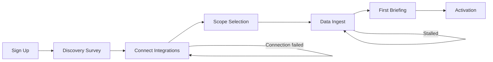

# Onboarding Flow Reference

This page describes the seven-step onboarding journey from sign-up to activation. Each step has an expected completion time and a recovery path for common failure modes.

## Step sequence

## Step-by-step reference

### Step 1: Sign Up

Expected time: under two minutes.

You create an account with your work email address. Email verification is handled by the authentication provider. Once verified, you are taken directly to the discovery survey.

Recovery: if the verification email does not arrive within five minutes, check your spam folder or request a new verification email from the sign-in page.

### Step 2: Discovery Survey

Expected time: under one minute.

One question with five options. You select the part of your week you most want to change. A free-text field is available if none of the options apply.

Recovery: the survey cannot stall. If the page fails to load, refresh and try again. Your selection is saved on submission.

### Step 3: Connect Integrations

Expected time: two to five minutes, depending on how many integrations you connect.

OAuth flows for Jira, GitHub, and Slack. Each requires authorization in a popup window that closes automatically on success.

Recovery: if a connection fails, the popup closes without the card showing a green checkmark. Click Connect again to retry. If repeated failures occur, verify that your account has the necessary read permissions in that service. You may connect as few as one integration and continue.

### Step 4: Scope Selection

Expected time: two to five minutes.

You review the pre-filtered list of active initiatives, repositories, and channels from your connected sources and confirm which ones should be included in your briefings.

Recovery: if the list is empty after connecting integrations, verify that the connected account has access to at least one active project or repository. You can also use the search field to find and add items manually.

### Step 5: Data Ingest

Expected time: two to fifteen minutes.

Context-OS reads the history of your selected scope. Progress is shown on screen. You do not need to stay on the page.

Recovery: if the ingest stalls (no progress for more than ten minutes), a retry button appears on the progress screen. Clicking it restarts the ingest from the last successful checkpoint. Common causes of stalls include API rate limits on the connected provider or a transient network issue. Retry resolves most stalls without losing progress.

### Step 6: First Briefing Review

Expected time: five to fifteen minutes.

The AI-generated draft briefing is presented for review. You read each section, edit inline as needed, and assess any failure flags the agent raised.

Recovery: the draft is saved automatically. If you close the browser and return later, the draft is intact. You can take as much time as you need on this step.

### Step 7: Activation

Expected time: under one minute.

You click Approve on the reviewed briefing. The workspace activates and full navigation becomes available. This step cannot be undone, but the briefing content can be updated in subsequent briefing cycles.

Recovery: if the Approve action fails due to a server error, refresh and try again. The draft is preserved on the server and the approval will be retried with the same content.
